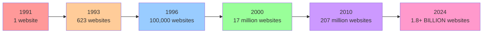

# Hey Myra! Welcome to Your Amazing HTML Adventure

Did you know that you are about to learn the same magical language that connects every person on Earth? That's right, Myra! HTML is the secret code that makes the internet work, and you're going to master it.

---

### The Incredible Story of How the Web Was Born

Picture this, Myra: It's 1989, and computers exist, but they can't really talk to each other very well. Then along comes this brilliant scientist named [Tim Berners-Lee](https://www.w3.org/People/Berners-Lee/){:target="_blank"} working at [CERN](https://home.cern/){:target="_blank"} - a massive science laboratory in Switzerland where they study the tiniest particles in the universe! Tim had this wild idea that seemed impossible at the time: "What if scientists anywhere in the world could instantly share their research just by clicking on words that connect to other documents?"

Most people thought he was dreaming too big, but Tim didn't give up. He spent months writing code, creating the very first web browser, and building what would become the foundation of everything we use today. When Tim was just 34 years old (only 23 years older than you are now!), he created the World Wide Web. The very first website went live on August 6, 1991 - that's over 30 years ago! It looked nothing like the colorful, interactive websites you see today. There were no videos, no photos, no fancy fonts, no games - just plain black text on a white background explaining what this "World Wide Web" thing was supposed to do.

#### Amazing Web Trivia Just for You

Here's where it gets really cool, Myra! Tim's first web browser was actually called "[WorldWideWeb](https://en.wikipedia.org/wiki/WorldWideWeb){:target="_blank"}" - yes, the same name as the web itself! Can you imagine how confusing that was? People would say "I'm using the WorldWideWeb to browse the World Wide Web!" So they renamed the browser to "Nexus" to avoid all the confusion.

And here's something absolutely amazing - **the very first website is STILL online today!** You can actually visit it right now at [http://info.cern.ch/hypertext/WWW/TheProject.html](http://info.cern.ch/hypertext/WWW/TheProject.html){:target="_blank"} and see exactly what the web looked like when it was born. It's like visiting a historical monument, but in cyberspace!

But here's the most incredible part of all: Tim Berners-Lee could have become the richest person on Earth by putting a patent on his invention. Think about it - every time someone used the web, they would have had to pay him money! But instead, he gave it away completely FREE to the entire world because he believed everyone should have access to information and knowledge. That decision changed everything for billions of people, including you and me.

Want to know just how remarkable the web's growth has been? Let's look at some impressive numbers:

<h4 style="margin-top: 0;">Website Growth Over Time</h4>

*From just 1 website to over 1.8 billion in just 33 years!*

---

Now that you understand how the web exploded from Tim's single idea into this massive digital universe, let's explore why HTML is the perfect creative medium for someone with your unique talents.

### Why HTML is Perfect for Creative Minds Like Yours

You know how you love creating art with your favorite colors - teal, purple, and yellow? Well, Myra, HTML is like having an infinite digital art canvas that never runs out of paint, never tears, and can be shared with people all around the world instantly! But what makes HTML truly special is how it combines the two things you love most: math and art.

#### HTML + Your Math Brain = Pure Magic!

Here's something that will connect to your love of math, Myra: colors in HTML are actually mathematical formulas! Your favorite teal color? It's `#2dd4bf` - which is actually a mathematical recipe telling the computer to mix specific amounts of red, green, and blue light. It's like being a scientist in a color laboratory! Web pages use coordinate systems just like the graphs you love in math class, where every element has an exact position measured in [pixels](https://en.wikipedia.org/wiki/Pixel){:target="_blank"}. Everything on a webpage has precise proportions, measurements, and mathematical relationships. Your mathematical mind will start seeing patterns everywhere - in the spacing between elements, in the golden ratio used for beautiful layouts, even in how [CSS Grid](https://developer.mozilla.org/en-US/docs/Web/CSS/CSS_Grid_Layout){:target="_blank"} uses mathematical principles to organize content!

#### HTML + Your Artistic Soul = Beautiful Digital Masterpieces!

Imagine being able to paint with code using any of the 16.7 million colors that computers can display, Myra! You can create layouts more flexible than any physical canvas, design interactive art that responds to people's mouse movements and clicks, build digital galleries to showcase your real artwork, and even create animations that bring your creations to life. Famous digital artists like [Rafael Lozano-Hemmer](https://www.lozano-hemmer.com/){:target="_blank"} and [Casey Reas](https://reas.com/){:target="_blank"} use code to create installations in major museums around the world!

---

### The Amazing Journey of Web Browsers

Every time you open a browser, Myra, you're using one of the most incredible inventions in human history! It's like having a magical window that can instantly transport you anywhere in the digital world. But browsers didn't start out as the powerful tools they are today. Their story is filled with competition, innovation, and some pretty dramatic battles!

#### The 1990s - When Everything Changed

Back in 1993, a group of students at the University of Illinois created something revolutionary called [Mosaic](https://en.wikipedia.org/wiki/Mosaic_(web_browser)){:target="_blank"}. It was the first browser that could actually show pictures! Can you imagine using the internet without any images, Myra? Before Mosaic, the web was just black text on gray backgrounds - no photos, no colors, no fun graphics at all.

Then in 1994, [Netscape Navigator](https://en.wikipedia.org/wiki/Netscape_Navigator){:target="_blank"} burst onto the scene and changed everything. It made the web colorful, fast, and actually fun to use! Netscape became so popular that by 1995, almost everyone was using it. But then the giant Microsoft decided they wanted a piece of the action, so they created [Internet Explorer](https://en.wikipedia.org/wiki/Internet_Explorer){:target="_blank"} and started what people called "the Browser Wars" - companies fighting to make the best browser!

#### The 2000s - The Revolution Begins

In 2003, Apple surprised everyone by releasing [Safari](https://www.apple.com/safari/){:target="_blank"}, a browser so beautiful and fast that it felt like magic. Around the same time, a group of passionate developers created [Mozilla Firefox](https://www.mozilla.org/en-US/firefox/){:target="_blank"} in 2004, giving people the freedom to customize their browsing experience like never before.

But the biggest shock came in 2008 when Google - a search company! - released [Chrome](https://www.google.com/chrome/){:target="_blank"}. Everyone thought Google was crazy to compete with established browsers, but Chrome was so incredibly fast and simple that it quickly became the most popular browser in the world!

#### Interesting Browser Facts

The very first [banner advertisement](https://en.wikipedia.org/wiki/Web_banner){:target="_blank"} on the internet was just a simple rectangle that said "Have you ever clicked your mouse right HERE? YOU WILL" - and guess what? It got a 44% click rate! Today, if an ad gets even 1% of people to click it, that's considered successful.

Here's something cool about [Google Chrome's logo](https://design.google/library/google-chrome-logo/){:target="_blank"}, Myra: those colors aren't random! They're actually based on the mathematical color theory you love studying. The blue, red, yellow, and green represent the [RGB color model](https://en.wikipedia.org/wiki/RGB_color_model){:target="_blank"} that computers use to create all colors on screen.

[Safari](https://www.apple.com/safari/){:target="_blank"} got its name because Apple wanted people to think of "going on a safari" to explore the internet jungle - discovering new and exciting websites like an adventure! And the word "browser" itself was chosen because you "browse" through information, just like browsing through books in a library or clothes in a store.

Want to see something really cool? There's a website called [Can I Use](https://caniuse.com/){:target="_blank"} where you can type in any web feature and see which browsers support it. It's like a compatibility detective tool that web developers use every day!

---

Speaking of the tools that power the web, let's dive deeper into HTML itself and discover some fascinating secrets about the language you're about to master.

### Incredible HTML Secrets That Most People Don't Know

Ready for some fascinating facts, Myra? These are the kinds of insights that even many adults who use the internet every day don't know!

#### The Magic Story of the First HTML Tags

Here's something amazing: the very first [HTML tag](https://developer.mozilla.org/en-US/docs/Web/HTML/Element){:target="_blank"} ever created was `<TITLE>` - because even Tim Berners-Lee knew that every website needed a name! It's like how every story needs a title, or every painting needs to be signed by the artist.

But get this - the `` tag (which lets us put pictures on websites) wasn't invented until 1993! That means the web existed for 2 whole years with absolutely NO IMAGES. Can you imagine [Instagram](https://www.instagram.com/){:target="_blank"} or [YouTube](https://www.youtube.com/){:target="_blank"} without any pictures or videos? It would be impossible!

And here's something that will connect to your love of math: the `<TABLE>` tag was originally created specifically to display mathematical data and scientific research - exactly the kind of work you enjoy! Scientists needed a way to share their number tables and formulas with colleagues around the world.

#### Mathematical Marvels Hidden in Web Design

Remember the [Golden Ratio](https://www.mathsisfun.com/numbers/golden-ratio.html){:target="_blank"} - a special number (1.618) that appears in sunflower spirals, seashells, and famous art? Web designers use this same principle to create layouts that feel naturally beautiful to look at! Many gorgeous websites use these proportions without most people even realizing it.

[Fibonacci sequences](https://kids.kiddle.co/Fibonacci_sequence){:target="_blank"} - a number pattern like 1, 1, 2, 3, 5, 8, 13... - sometimes appear in website design, especially in how sites adapt to different screen sizes. It's the same pattern you find when counting flower petals! [Check out this fun explanation](https://www.scienceforkidsclub.com/projects/the-fibonacci-sequence-where-is-it-in-nature.html){:target="_blank"} of how nature uses this pattern.

And all those beautiful color combinations you see on websites? They're based on [color theory principles](https://en.wikipedia.org/wiki/Color_theory){:target="_blank"} that help determine which colors work well together - like your favorite teal, purple, and yellow combination!

#### HTML Trivia That You'll Find Remarkable

There used to be an HTML tag called `<BLINK>` that made text flash on and off like a neon sign. It became SO annoying that web developers everywhere complained, and browsers eventually stopped supporting it entirely! It's like the internet's equivalent of a fashion trend that was so bad it had to be banned.

When HTML was first created, it had only 18 different tags. Today, there are over 100 different [HTML elements](https://developer.mozilla.org/en-US/docs/Web/HTML/Element){:target="_blank"} you can use - it's like having a massive box of digital art supplies! The longest valid HTML tag name is `<figcaption>` at 10 characters, and here's something incredible: you can actually create a complete website with just 7 words of HTML: `<html><body>Hello World</body></html>`.

#### Your Future Possibilities Are Absolutely Endless

Did you know that web developers can earn anywhere from $50,000 to $150,000+ per year just for creating digital art and websites? But HTML isn't just for web developers - it's used in many exciting careers! Here are just some of the amazing jobs that rely on HTML skills:

- **Java Developer** - Building powerful applications and websites
- **Software Engineer** - Creating the apps and programs people use every day  
- **Software Developer** - Designing digital solutions for real-world problems
- **App Developer** - Making mobile apps for phones and tablets
- **Technical Writer** - Explaining complex technology in simple, helpful ways
- **Graphic Designer** - Combining visual art with web technology
- **Computer Programmer** - Writing code that powers everything from games to NASA missions

But more than the money, think about the creative possibilities: you could build the next [Instagram](https://www.instagram.com/){:target="_blank"}, [TikTok](https://www.tiktok.com/){:target="_blank"}, or create a completely new type of social platform that no one has even imagined yet! Digital artists who code their own websites have complete creative freedom - there are literally no limits to what you can create.

---

With all these amazing possibilities in mind, let's talk about why your specific combination of interests and talents makes you perfectly suited for web development success.

### Why YOU, Myra, Are Going to Excel at This

Here's something incredible that most people don't realize: your unique combination of artistic talent and mathematical thinking is EXACTLY what makes the most successful web developers in the world! You're not just learning to code - you're developing a superpower.

#### Famous Web Designers Who Started as Artists Just Like You

Meet [Jessica Hische](https://jessicahische.is/){:target="_blank"}, who started as a lettering artist drawing beautiful fonts by hand. She fell in love with web design and now creates stunning digital experiences for major companies like [Wes Anderson movies](https://en.wikipedia.org/wiki/Wes_Anderson){:target="_blank"} and [The New York Times](https://www.nytimes.com/){:target="_blank"}!

Then there's [Tobias van Schneider](https://vanschneider.com/){:target="_blank"}, who began his career as a musician but discovered that the same creativity that helped him compose music could be used to design incredible websites. His portfolio is like a digital art museum!

And [Sarah Drasner](https://sarahdrasnerdesign.com/){:target="_blank"} started as a traditional artist and animator. Now she leads web development teams at major tech companies and creates [animations with code](https://css-tricks.com/){:target="_blank"} that are displayed in galleries around the world.

#### Your Secret Superpowers in Web Development

Your love of math means you'll understand [CSS layouts](https://developer.mozilla.org/en-US/docs/Learn/CSS/CSS_layout){:target="_blank"}, [responsive design](https://developer.mozilla.org/en-US/docs/Learn/CSS/CSS_layout/Responsive_Design){:target="_blank"}, and color mathematics more intuitively than most adults who've been coding for years! Your artistic eye will help you create websites that aren't just functional, but absolutely beautiful. Your attention to detail - the same skill that makes your artwork so precise - will make your code clean, professional, and bug-free. And your creativity will help you solve problems in ways that other developers never even think of trying.

---

As you develop these skills, you'll start noticing fascinating connections between web development and the world around you.

### The Amazing Things You'll Discover Along the Way

As you learn HTML, Myra, you'll start uncovering incredible secrets about how the digital world really works! You'll understand how [Netflix](https://www.netflix.com/){:target="_blank"} decides what shows to recommend to you (hint: it's partly based on web data and algorithms), why some websites load instantly while others take forever (you'll learn to make lightning-fast sites), how your favorite artists sell their work online through platforms like [Etsy](https://www.etsy.com/){:target="_blank"} and [DeviantArt](https://www.deviantart.com/){:target="_blank"} (you'll even build your own art marketplace), and why certain color combinations make people feel happy, excited, or calm ([color psychology](https://en.wikipedia.org/wiki/Color_psychology){:target="_blank"} meets code!).

But here's the particularly interesting aspect: Every single website you visit - from [YouTube](https://www.youtube.com/){:target="_blank"} to [Instagram](https://www.instagram.com/){:target="_blank"} to your school's website to [NASA's space exploration site](https://www.nasa.gov/){:target="_blank"} - is built with the exact same HTML you're about to learn. You're not just learning a skill; you're learning the universal language that connects our entire digital world!

---

### Ready to Start Your Epic Journey?

Myra, you're about to join an exclusive club of creators who can build absolutely anything they can imagine on the internet! Think about this: [Tim Berners-Lee](https://www.w3.org/People/Berners-Lee/){:target="_blank"} started with just an idea and changed the entire world. [Mark Zuckerberg](https://en.wikipedia.org/wiki/Mark_Zuckerberg){:target="_blank"} created [Facebook](https://www.facebook.com/){:target="_blank"} in his college dorm room when he was just 19 years old. [Reshma Saujani](https://reshmasaujani.com/){:target="_blank"} founded [Girls Who Code](https://girlswhocode.com/){:target="_blank"} to teach millions of girls like you to become programmers and change the world.

You're starting your journey right here, right now, with the same exact tools they used - HTML. Your adventure begins with learning the foundational magic that powers everything from [Google](https://www.google.com/){:target="_blank"} to [Spotify](https://www.spotify.com/){:target="_blank"} to [Khan Academy](https://www.khanacademy.org/){:target="_blank"}.

Are you ready to discover how websites are really made? Ready to create digital art that millions of people around the world could see and enjoy? Ready to turn your mathematical mind and artistic soul into web development superpowers that could literally change the internet?

---

### Let's Get You Started on This Amazing Adventure!

First things first - let's make sure your digital art studio is ready to create magic:

**[Set up your coding workspace](setup-guide.md)** - Transform your computer into the ultimate digital canvas where you'll paint with code!

**Ready to start learning?** Jump directly into [Chapter 1 - HTML Essentials](chapters/chapter1/) to begin your coding adventure and start building your very first websites!

---

#### An Interesting Historical Note

The very first [emoticon](https://en.wikipedia.org/wiki/Emoticon){:target="_blank"} 🙂 was created in 1982 by computer scientist [Scott Fahlman](https://en.wikipedia.org/wiki/Scott_Fahlman){:target="_blank"} at Carnegie Mellon University. He had no idea that this simple combination of characters would eventually lead to the billions of emojis we use today! Now, over 40 years later, you can create websites with animated emojis, interactive graphics, and digital art that moves, dances, and responds to users in real-time.

#### Get Inspired by What's Possible

Before you start coding, check out these absolutely incredible websites that will show you what's possible when creativity meets code:

**[CodePen.io](https://codepen.io/pen/){:target="_blank"}** - This is like the YouTube of coding! Explore thousands of creative projects made by artists and developers from around the world. You'll find everything from animated logos to interactive games built with just HTML, CSS, and JavaScript.

**[CSS Design Awards](https://www.cssdesignawards.com/){:target="_blank"}** - See the most stunning, award-winning website designs on the planet. These sites will inspire your own projects and show you what's possible when you combine artistic vision with coding skills.

**[The History of Web Design](https://thehistoryoftheweb.com/timeline/){:target="_blank"}** - Take an interactive journey through time and see how websites evolved from simple text pages to the incredible digital experiences we have today.

Remember, Myra: Every expert was once a beginner. Every incredible website started with a single line of HTML. And every amazing web developer started exactly where you are right now - with curiosity, creativity, and the burning desire to build something amazing that the world has never seen before.

The internet is waiting for what YOU will create! Let's begin your HTML adventure and turn your dreams into digital reality!